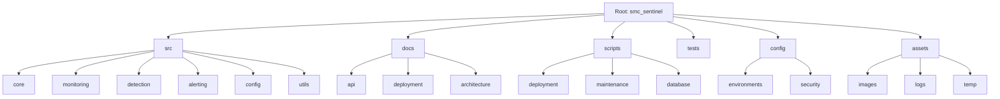

# Diagrama de Estrutura

Notas:
- `smc_sentinel` (pacote Python) permanece por compatibilidade; `src` define organização por funcionalidade para migrações futuras.
- `docs` foi reorganizado em `api`, `deployment` e `architecture`.